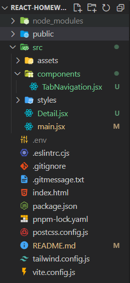
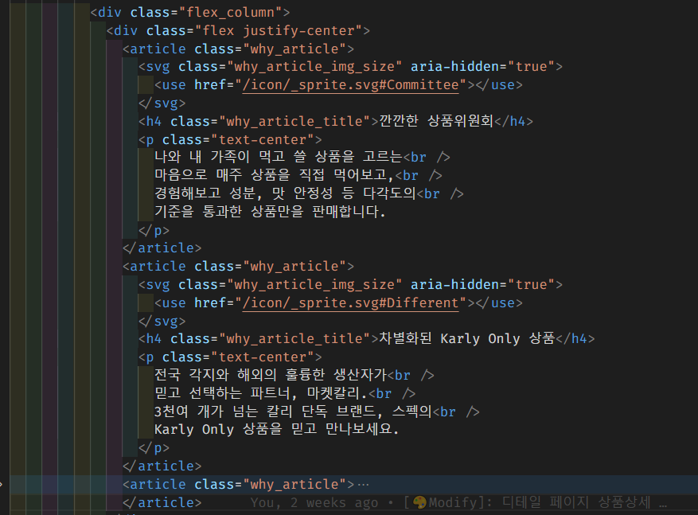
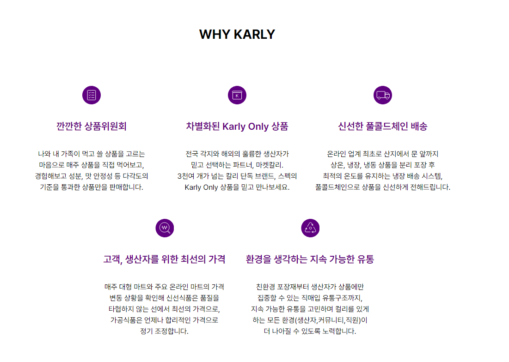

# 🦁 멋쟁이 사자처럼 \_ React

<details>
  <summary>목차</summary>
  <ul>
    <li><a href='#프로그램-초기-세팅-wrench'> 프로그램 초기 세팅 🔧</a></li>
    <li><a href='#폴더-구성-'>폴더 구성 💼</a></li>
    <li><a href='#코드-수정-'>코드 수정 💊</a></li>
    <li><a href='#결과'>결과 🎉</a></li>
    <li><a href='#아쉬운-점--과제를-하며-느낀-점'>아쉬운 점 😥 & 과제를 하며 느낀 점 😀</a></li>
  </ul>
</details>

- [ ] JSX 또는 React API를 사용해, Vanilla 프로젝트에서 구현한
      인터페이스의 일부를 마크업하여 웹 브라우저에 렌더링

---

#### 프로그램 초기 세팅 :wrench:

**:sparkles: vite 설치**

```bash
pnpm create vite@latest react-homework
react => JavaScript 선택

cd react-homework
```

**🌫 tailwind 설치 및 세팅**

```bash
pnpm add -D tailwindcss postcss autoprefixer postcss-import
pnpm tailwindcss init -p
```

```css
/* 📂 tailwind.css */
@import "tailwindcss/base";
@import "tailwindcss/components";
@import "tailwindcss/utilities";
```

```js
/* 📂 최상위 mai.jsx */
/* tailwind.css 파일 생성 후 최상위 main.jsx 파일에서 import */
import "./styles/tailwind.css";
```

```js
/* 📂tailwind.config.js */
content: ["./index.html", "./src/**/*.jsx"];
```

---

#### 폴더 구성 💼

</img>

---

#### 코드 수정 💊

</img>

- 중복되는 코드가 많아 코드량이 길어지며, 가독성이 떨어졌습니다.
- 리액트로 넘어오면서 `content`를 객체,배열에 담아 `map`을 이용하여 중복되는 코드를 반복문을 통해 줄여주었습니다.

```jsx
const whyKarly = [
  {
    svgImg: "/icon/_sprite.svg#Committee",
    title: "깐깐한 상품위원회",
    content: (
      <>
        나와 내 가족이 먹고 쓸 상품을 고르는
        <br />
        마음으로 매주 상품을 직접 먹어보고,
        <br />
        경험해보고 성분, 맛 안정성 등 다각도의
        <br />
        기준을 통과한 상품만을 판매합니다.
      </>
    ),
  },
  {
    svgImg: "/icon/_sprite.svg#Different",
    title: "차별화된 Karly Only 상품",
    content: (
      ...
//////////////////////////////////////////////////////////////
{
  whyKarly.map((card, index) => (
    <article className="why_article" key={index}>
      <svg className="why_article_img_size" aria-hidden="true">
        <use href={card.svgImg}></use>
      </svg>
      <h4 className="why_article_title">{card.title}</h4>
      <p className="text-center">{card.content}</p>
    </article>
  ));
}
```

---

#### 결과 🎉

</img>

#### 아쉬운 점 & 과제를 하며 느낀 점 😀

> 데이터를 가져와서 뿌려주는 게 많은 페이지라 아직은 리액트로 데이터를 뿌려주는 작업이 어려워서 가장 쉬운 단계부터 하게 된 것 같습니다.
> 제가 과제를 잘 이해하고 수행했는 지 모르겠습니다. 하지만 리액트를 통해 코드가 간결해지고, 기존의 HTML 코드보다 따로 관리가 편해서 유지 보수 측면에서도 리액트의 사용이 순수 자바스크립트보다 나은 선택일 수 있겠다고 생각했습니다.
> 다음에는 Javascript를 제어하는 기능을 추가로 넣어보고 싶습니다.
